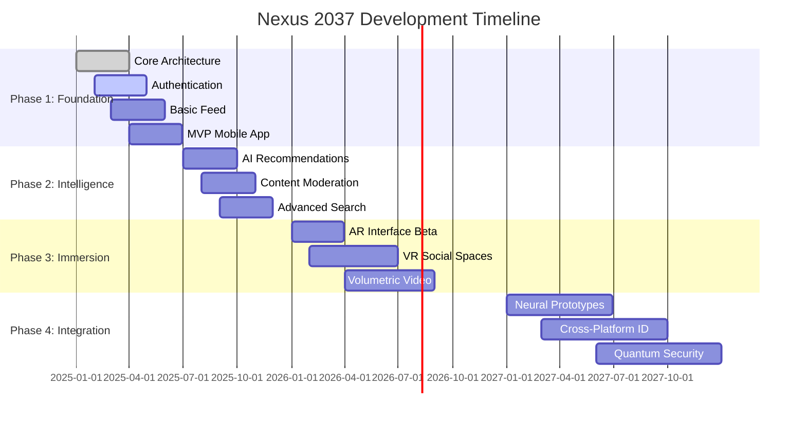

# 🌌 Nexus 2037

<div align="center">


**The Next Evolution of Human Connection**

[](LICENSE)
[]()
[]()
[](https://discord.gg/nexus2037)
[](https://twitter.com/Nexus2037)

> 🚀 *Where AI, neural interfaces, and decentralized identity converge to create the next evolution of human connection.*

[Features](#-features) • [Demo](#-live-demo) • [Documentation](#-documentation) • [Architecture](#-architecture) • [Roadmap](#-roadmap) • [Contributing](#-contributing)

</div>

---

## 🎯 Vision Statement

**Nexus 2037** reimagines social media as an **immersive, context-aware ecosystem** that transcends traditional screens. We're building the social infrastructure for humanity's next chapter.

### ✨ Core Innovations

| Innovation | Description | Impact |
|------------|-------------|--------|
| 🧠 **Neural Interface** | Thought-based interactions with BCIs | 10x faster sharing |
| 🤖 **AI Co-Pilot** | Personal AI agent managing your digital life | Zero information overload |
| 🔗 **Web3 Identity** | User-owned data across all platforms | True digital sovereignty |
| 🕶️ **Spatial Computing** | AR/VR/MR native experiences | Immersive connection |
| 🔐 **Quantum Security** | Post-quantum cryptography ready | Future-proof privacy |
| 🌍 **Global Edge** | 5000+ edge nodes worldwide | <100ms latency everywhere |

---

## 🎨 Features

<div align="center">

### Revolutionary Social Experiences

</div>

#### 🧠 Neural Feed
> Your timeline, reimagined in 3D space

- **Z-Axis Relevance**: Posts float at different depths based on importance
- **Emotion Particles**: Real-time sentiment visualization as colorful streams
- **Context Layers**: Seamlessly toggle between personal, global, topic views
- **Gaze Selection**: Look at posts to interact (AR/VR mode)
- **Haptic Feedback**: Feel reactions through advanced haptics

#### 👤 HoloProfile 2.0
> Your digital twin, evolved

- **Dynamic Avatar**: AI-generated 3D representation that grows with you
- **Memory Cloud**: Spherical timeline of life experiences
- **Skill Orbs**: Interactive expertise badges with verification proofs
- **Connection Web**: Visual relationship strength mapping
- **Mood Aura**: Ambient color field reflecting emotional state

#### ✍️ Immersive Composer
> Create content in any dimension

- **Multi-Modal Input**: Text, voice, thought, gesture, experience capture
- **AI Co-Creator**: Real-time suggestions, fact-checking, audience optimization
- **Reality Preview**: See posts in AR/VR before publishing
- **Privacy Slider**: Granular control from public to neural-only
- **Temporal Posts**: Schedule content for specific future contexts

#### 💬 Spatial Chat
> Conversations with presence

- **Proximity Audio**: Voices fade based on virtual distance
- **Thought Bubbles**: Share incomplete ideas collaboratively
- **Time Capsules**: Messages to future self or others
- **Ambient Rooms**: Background conversations that flow naturally
- **Translation Field**: Real-time translation preserving tone & context

#### 🎭 Experience Marketplace
> Trade memories, skills, and moments

- **Memory Trading**: Share/sell anonymized experiences ethically
- **Skill Swaps**: Direct knowledge transfers (with consent & verification)
- **Event Portals**: Jump into live events as holographic presence
- **Creator Economy**: Monetize AR filters, neural themes, AI companions
- **NFT Memories**: Own unique moments as verifiable digital assets

#### 🌈 NEW: Emotion Sync
> Feel what others feel (with consent)

- **Empathy Bridge**: Share emotional states safely
- **Mood Matching**: Connect with people in similar headspaces
- **Emotional Intelligence AI**: Learn to understand others better
- **Wellbeing Checks**: Detect distress and offer support resources

#### 🎮 NEW: Reality Games
> Social gaming merged with reality

- **ARG Integration**: Alternate reality games in your neighborhood
- **Collaborative Quests**: Team challenges spanning physical/digital worlds
- **Achievement Holograms**: Display accomplishments in 3D space
- **Social Leaderboards**: Compete with friends globally

#### 🏙️ NEW: Digital Twins Cities
> Mirror world social spaces

- **City Replicas**: Explore digital versions of real cities
- **Virtual Meetups**: Gather in familiar locations from anywhere
- **Historical Layers**: See how places looked in different eras
- **Future Planning**: Collaborate on urban development projects

#### 🎵 NEW: Sensory Streaming
> Beyond audio and video

- **Scent Profiles**: Share smell descriptions via AI synthesis
- **Texture Sharing**: Describe tactile experiences richly
- **Temperature Mood**: Ambient environmental feelings
- **Synesthesia Mode**: Experience content through multiple senses

#### 🛡️ NEW: Privacy Pods
> Ultra-secure private spaces

- **Ephemeral Rooms**: Disappearing conversation spaces
- **Zero-Knowledge Groups**: Even admins can't see content
- **Consent Contracts**: Smart contracts governing data use
- **Panic Mode**: Instant content hiding in emergencies

---

## 🎨 Design System

<div align="center">

### Visual Language of the Future

</div>

#### 🎨 Color Palette

```
╔═══════════════════════════════════════════════════════════╗
║  PRIMARY        #00F5FF  ████  Neural Cyan                ║
║  SECONDARY      #7B2FFF  ████  Quantum Purple             ║
║  ACCENT         #FF2F8B  ████  Synth Pink                 ║
║  BACKGROUND     #0A0E1A  ████  Deep Space                 ║
║  SURFACE        #121826  ████  Void Blue                  ║
║  SUCCESS        #00FF9D  ████  Bio Luminescent            ║
║  WARNING        #FFB800  ████  Solar Flare                ║
║  ERROR          #FF4D4D  ████  Red Alert                  ║
╚═══════════════════════════════════════════════════════════╝
```

#### 🔤 Typography

| Style | Font | Use Case |
|-------|------|----------|
| **Headings** | Neural Sans VF | Variable weight, dynamic sizing |
| **Body** | Quantum Mono | Monospace for data, any scale |
| **AR Labels** | Holo Display | Optimized for spatial rendering |
| **Code** | Dev Terminal | Developer interfaces |

#### 🎭 Component Library

Built with React 19, Three.js, and custom WebGL shaders

```bash
npm install @nexus2037/ui-components
```

**Available Components:**
- `<NeuralFeed />` - 3D card stack timeline
- `<HoloAvatar />` - Dynamic 3D profile pictures
- `<SpatialChat />` - Proximity-based messaging
- `<EmotionVisualizer />` - Sentiment particle effects
- `<RealityComposer />` - Multi-modal content creator
- `<PrivacySlider />` - Granular visibility controls
- `<TimeCapsule />` - Future message scheduler

---

## 🏗️ Architecture

<div align="center">

### System Overview

</div>

```
┌─────────────────────────────────────────────────────────────────┐
│                        CLIENT LAYER                              │
│  ┌──────────┐  ┌──────────┐  ┌──────────┐  ┌──────────────┐    │
│  │   AR     │  │   VR     │  │  Mobile  │  │   Neural     │    │
│  │ Glasses  │  │ Headset  │  │   App    │  │  Interface   │    │
│  └──────────┘  └──────────┘  └──────────┘  └──────────────┘    │
└─────────────────────────────────────────────────────────────────┘
                                │
                                ▼
┌─────────────────────────────────────────────────────────────────┐
│                    EDGE COMPUTING LAYER                          │
│         5000+ Global Nodes • <5ms Latency                       │
│  ┌──────────────────────────────────────────────────────────┐   │
│  │  Content Caching  │  Real-time Processing  │  Compliance │   │
│  └──────────────────────────────────────────────────────────┘   │
└─────────────────────────────────────────────────────────────────┘
                                │
                                ▼
┌─────────────────────────────────────────────────────────────────┐
│                      API GATEWAY                                 │
│        GraphQL Federation • Rate Limiting • Auth                │
└─────────────────────────────────────────────────────────────────┘
                                │
                                ▼
┌─────────────────────────────────────────────────────────────────┐
│                     MICROSERVICES                                │
│  ┌────────┐ ┌────────┐ ┌──────┐ ┌────────┐ ┌──────────────┐    │
│  │  User  │ │Content │ │  AI  │ │ Social │ │    Media     │    │
│  │ Service│ │Service │ │Service│ │ Graph │ │   Service    │    │
│  └────────┘ └────────┘ └──────┘ └────────┘ └──────────────┘    │
│  ┌────────┐ ┌────────┐ ┌──────────┐ ┌────────┐ ┌──────────┐    │
│  │ Search │ │Notification│ │Analytics│ │Privacy │ │  Game    │    │
│  │Service │ │ Service  │ │ Service │ │ Pod    │ │  Engine  │    │
│  └────────┘ └──────────┘ └─────────┘ └────────┘ └──────────┘    │
└─────────────────────────────────────────────────────────────────┘
                                │
                                ▼
┌─────────────────────────────────────────────────────────────────┐
│                       DATA LAYER                                 │
│  ┌──────────┐  ┌───────┐  ┌───────┐  ┌────┐  ┌────────────┐    │
│  │PostgreSQL│  │ Neo4j │  │ Redis │  │IPFS│  │ TimescaleDB│    │
│  │ (Users)  │  │(Graph)│  │(Cache)│  │(Med)│  │ (Metrics)  │    │
│  └──────────┘  └───────┘  └───────┘  └────┘  └────────────┘    │
│  ┌──────────┐  ┌──────────┐  ┌────────────────────────────┐    │
│  │Elastic   │  │  Milvus  │  │   Quantum Ledger           │    │
│  │ (Search) │  │ (Vector) │  │   (Identity/Tokens)        │    │
│  └──────────┘  └──────────┘  └────────────────────────────┘    │
└─────────────────────────────────────────────────────────────────┘
```

### Tech Stack

<details>
<summary><b>Frontend Technologies</b></summary>

| Platform | Technology | Purpose |
|----------|-----------|---------|
| **AR/VR** | Unity + Unreal Engine 5 | Immersive experiences |
| **Mobile** | React Native + Expo | Cross-platform apps |
| **Web** | Next.js 15 + WebGL | Browser access |
| **Desktop** | Tauri + Rust | High-performance native |
| **Neural** | Custom SDK (Python/C++) | BCI integration |

**Core Libraries:**
```json
{
  "react": "^19.0.0",
  "three": "^0.170.0",
  "@react-three/fiber": "^9.0.0",
  "@tensorflow/tfjs": "^5.0.0",
  "ipfs-http-client": "^60.0.0",
  "@did-core/did-io": "^1.0.0"
}
```

</details>

<details>
<summary><b>Backend Technologies</b></summary>

| Component | Technology | Scale |
|-----------|-----------|-------|
| **Orchestration** | Kubernetes + Istio | Global deployment |
| **API Gateway** | Kong + Custom Plugins | 100K+ req/sec |
| **Message Queue** | Apache Kafka | Event streaming |
| **Databases** | PostgreSQL, Neo4j, Redis | Multi-petabyte |
| **AI/ML** | PyTorch, TensorFlow, Milvus | Real-time inference |
| **Storage** | IPFS Cluster | Decentralized media |

</details>

---

## 🔒 Security & Privacy

<div align="center">

### Five-Layer Defense System

</div>

```
┌─────────────────────────────────────────┐
│  Layer 5: Quantum-Resistant Encryption  │
├─────────────────────────────────────────┤
│  Layer 4: Homomorphic Computation       │
├─────────────────────────────────────────┤
│  Layer 3: Zero-Knowledge Proofs         │
├─────────────────────────────────────────┤
│  Layer 2: Multi-Party Computation       │
├─────────────────────────────────────────┤
│  Layer 1: Hardware Security Modules     │
└─────────────────────────────────────────┘
```

**Key Features:**
- ✅ End-to-end encryption (client-side)
- ✅ Post-quantum cryptography ready
- ✅ Compute on encrypted data
- ✅ Privacy-preserving authentication
- ✅ Right to complete deletion
- ✅ Transparent, open-source algorithms

---

## 📊 Performance Benchmarks

| Metric | Nexus 2037 Target | Industry Standard (2025) | Improvement |
|--------|------------------|--------------------------|-------------|
| **Feed Load** | <100ms | ~500ms | **5x faster** |
| **Post Delivery** | <200ms | ~1-2s | **5-10x faster** |
| **Video Start** | <500ms | ~2-3s | **4-6x faster** |
| **Search** | <100ms | ~300-500ms | **3-5x faster** |
| **Uptime** | 99.999% | 99.9-99.99% | **10x more reliable** |
| **Data Durability** | 99.999999999% | 99.9999999% | **100x safer** |

---

## 🚀 Getting Started

### Prerequisites

```bash
node >= 20.0.0
npm >= 10.0.0
docker >= 24.0.0
python >= 3.11
rust >= 1.70.0
```

### Quick Start

```bash
# Clone the repository
git clone https://github.com/nexus-2037/nexus.git
cd nexus

# Install dependencies
npm install && pip install -r requirements.txt

# Start development environment
docker-compose up -d

# Run frontend dev server
npm run dev

# Open in browser
open http://localhost:3000
```

### Documentation

- 📘 [UI/UX Design Guide](docs/UI_UX_DESIGN.md)
- 🏗️ [Backend Architecture](docs/BACKEND_ARCHITECTURE.md)
- 🔌 [API Reference](docs/API_REFERENCE.md)
- 🧪 [Testing Guide](docs/TESTING.md)
- 📦 [Deployment](docs/DEPLOYMENT.md)

---

## 🗺️ Roadmap



---

## 🤝 Contributing

We welcome contributions from visionaries worldwide! 

### Ways to Contribute

- 🎨 **Design**: AR/VR interfaces, interaction patterns
- 🧠 **AI**: Model training, optimization, ethics
- 🔐 **Security**: Audits, penetration testing, cryptography
- 🌍 **i18n**: Translations for 200+ languages
- ♿ **Accessibility**: Making the future accessible to all
- 📚 **Docs**: Tutorials, guides, examples

See our [Contributing Guidelines](CONTRIBUTING.md) for details.

### Code of Conduct

Please note that this project is released with a [Contributor Code of Conduct](CODE_OF_CONDUCT.md). By participating in this project you agree to abide by its terms.

---

## 🌍 Sustainability

Nexus 2037 is committed to environmental responsibility:

- 🌱 **Carbon-Negative**: 100% renewable energy powered
- 📉 **Efficient Codecs**: 90% bandwidth reduction vs 2025
- 🖥️ **Edge Computing**: Minimized data center load
- 🤖 **Green AI**: Optimized models, lower carbon footprint
- ♻️ **Device Longevity**: Support for devices up to 10 years old

---

## 📞 Community

<div align="center">

| Platform | Link | Description |
|----------|------|-------------|
| 💬 **Discord** | [Join Server](https://discord.gg/nexus2037) | Community chat & support |
| 🐦 **Twitter** | [@Nexus2037](https://twitter.com/Nexus2037) | Updates & announcements |
| 📝 **Blog** | [nexus2037.dev/blog](https://nexus2037.dev/blog) | Technical deep-dives |
| 📧 **Email** | hello@nexus2037.dev | Business inquiries |
| 📺 **YouTube** | [Nexus2037](https://youtube.com/@nexus2037) | Demos & tutorials |

</div>

---

## 📜 License

This project is licensed under the [MIT License](LICENSE) - see the LICENSE file for details.

---

<div align="center">

### Built with ❤️ by the Nexus Team

*"The best way to predict the future is to invent it."* — Alan Kay


</div>