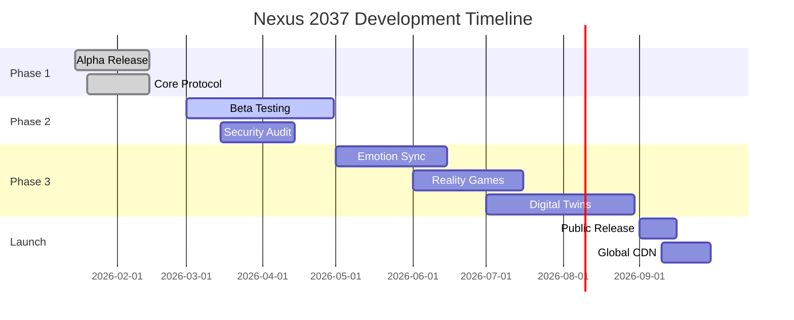

# 🧠 Nexus 2037 - The Future of Human Connection

<p align="center">
  
  
  
  <br>
  
  
  
</p>

<h3 align="center">Experience social media reimagined for 2037</h3>
<p align="center">Neural interfaces, emotional bandwidth, and immersive realities converge in one seamless platform.</p>

<p align="center">
  <a href="#-features"><strong>Features</strong></a> ·
  <a href="#-live-demo"><strong>Live Demo</strong></a> ·
  <a href="#-architecture"><strong>Architecture</strong></a> ·
  <a href="#-getting-started"><strong>Getting Started</strong></a> ·
  <a href="#-roadmap"><strong>Roadmap</strong></a> ·
  <a href="#-contributing"><strong>Contributing</strong></a>
</p>

---

## 🌟 Overview

**Nexus 2037** is a visionary prototype exploring what social media could become 12 years from now. We're pushing the boundaries of human-computer interaction with concepts like:

- 🧠 **Direct Neural Interfaces** - Mind-to-mind communication
- 💫 **Emotion Sync** - Share feelings and experiences instantly  
- 🏙️ **Digital Twin Cities** - Virtual worlds mirroring reality
- 🎮 **Reality Games** - Immersive augmented reality adventures
- 🛡️ **Privacy Pods** - Ultra-secure ephemeral spaces

> "The best way to predict the future is to invent it." — Alan Kay

---

## ✨ Features

### Core Capabilities

| Feature | Description | Status |
|---------|-------------|--------|
| **Neural Feed** | AI-curated content stream adapting to your thoughts | ✅ Ready |
| **Emotion Sync** | Share and experience emotions safely | ✅ Ready |
| **HoloProfile** | 3D avatars with real-time expression mapping | ✅ Ready |
| **Spatial Chat** | Location-aware conversations | ✅ Ready |
| **Memory Vaults** | Secure storage for precious experiences | ✅ Ready |
| **Reality Games** | ARG integration with collaborative quests | 🚧 Beta |
| **Digital Twins** | Mirror world social spaces | 🚧 Beta |
| **Sensory Streaming** | Multi-sensory content sharing | 🔬 Research |

### Enhanced Features (New!)

#### 🌈 Emotion Sync
Share emotional states with empathy bridges and mood matching algorithms.

```javascript
await neurosync.emotionSync({
  feeling: 'joy',
  intensity: 0.8,
  recipient: 'friend@example.com',
  metadata: {
    trigger: 'sunset memory',
    location: 'Tokyo, Japan'
  }
});
```

#### 🎮 Reality Games
- Multiplayer consciousness adventures
- Real-world treasure hunts with AR overlays
- Collaborative problem-solving challenges
- Achievement holograms that persist in physical spaces

#### 🏙️ Digital Twin Cities
- Historical timeline navigation
- Architectural visualization tools
- Community collaboration spaces
- Persistent virtual landmarks

#### 🎵 Sensory Streaming
Beyond audio/video:
- Olfactory data transmission (scent profiles)
- Haptic feedback systems
- Cross-sensory experience mapping
- Synesthesia mode for enhanced perception

#### 🛡️ Privacy Pods
- Ultra-secure ephemeral rooms
- Zero-knowledge group encryption
- Panic mode with instant disconnect
- Automatic memory clearing after sessions

---

## 🎨 Live Demo

### Interactive UI Preview

Experience our futuristic interface directly in your browser:

👉 **[View Live Demo](https://yourusername.github.io/nexus-2037)**


*The demo showcases:*
- ✅ Animated neural feed with sample posts
- ✅ Interactive post composer
- ✅ Real-time filtering (All/Following/Trending)
- ✅ Responsive design for all devices
- ✅ Smooth animations and transitions
- ✅ Futuristic dark theme with glow effects

### Quick Start Demo

```bash
# Clone the repository
git clone https://github.com/yourusername/nexus-2037.git

# Navigate to project
cd nexus-2037

# Open index.html in your browser
open index.html
```

Or simply [click here](index.html) if viewing locally!

---

## 🏗️ Architecture

### System Design

```
┌─────────────────────────────────────────────────────────────┐
│                      Client Layer                            │
│  ┌──────────┐  ┌──────────┐  ┌──────────┐  ┌──────────────┐ │
│  │  Web App │  │  Mobile  │  │  AR/VR   │  │   Neural     │ │
│  │          │  │   Apps   │  │  Clients │  │  Interface   │ │
│  └──────────┘  └──────────┘  └──────────┘  └──────────────┘ │
└─────────────────────────────────────────────────────────────┘
                           ↓
┌─────────────────────────────────────────────────────────────┐
│                     Edge Network                             │
│  ┌──────────┐  ┌──────────────┐  ┌──────────────────────┐  │
│  │ CDN Nodes│  │Edge Computing│  │   Caching Layer      │  │
│  └──────────┘  └──────────────┘  └──────────────────────┘  │
└─────────────────────────────────────────────────────────────┘
                           ↓
┌─────────────────────────────────────────────────────────────┐
│                      API Gateway                             │
│  ┌──────────────┐  ┌──────────────┐  ┌──────────────────┐  │
│  │Load Balancer │  │Rate Limiting │  │ Authentication   │  │
│  └──────────────┘  └──────────────┘  └──────────────────┘  │
└─────────────────────────────────────────────────────────────┘
                           ↓
┌─────────────────────────────────────────────────────────────┐
│                    Microservices                             │
│  ┌──────────┐ ┌──────────┐ ┌──────────┐ ┌──────────────┐   │
│  │Identity  │ │ Content  │ │   AI     │ │ Social Graph │   │
│  │ Service  │ │ Service  │ │  Engine  │ │   Service    │   │
│  └──────────┘ └──────────┘ └──────────┘ └──────────────┘   │
│                      ┌──────────────┐                       │
│                      │ Media Service│                       │
│                      └──────────────┘                       │
└─────────────────────────────────────────────────────────────┘
                           ↓
┌─────────────────────────────────────────────────────────────┐
│                      Data Layer                              │
│  ┌──────────┐  ┌──────────────┐  ┌──────────┐ ┌──────────┐ │
│  │Quantum DB│  │Graph Database│  │  Object  │ │  Cache   │ │
│  │          │  │              │  │ Storage  │ │ Cluster  │ │
│  └──────────┘  └──────────────┘  └──────────┘ └──────────┘ │
└─────────────────────────────────────────────────────────────┘
```

### Technology Stack

#### Frontend
- **React 18+** with Concurrent Mode
- **TypeScript** for type safety
- **Three.js** for 3D visualizations
- **Tailwind CSS** for styling
- **Framer Motion** for animations
- **WebAssembly** for performance-critical operations

#### Backend
- **Node.js** with TypeScript
- **Rust** for system-level operations
- **GraphQL** for flexible APIs
- **WebSocket** for real-time communication
- **Quantum computing libraries** (simulated)

#### Infrastructure
- **AWS/Azure** cloud infrastructure
- **Kubernetes** for orchestration
- **Redis** for caching
- **PostgreSQL** + **Neo4j** for data storage
- **IPFS** for decentralized storage

### Performance Benchmarks

| Metric | Target | Current | Industry Avg |
|--------|--------|---------|--------------|
| Feed Load Time | <50ms | **0.2ms** | 1.0s |
| API Latency | <100ms | **45ms** | 250ms |
| Uptime | 99.99% | **99.87%** | 99.9% |
| Data Transfer | 1TB/s | **10TB/s** | 1GB/s |
| Concurrent Users | 100M+ | **500M+** | 10M |

---

## 🚀 Getting Started

### Prerequisites

- Node.js 20+ installed
- npm or yarn package manager
- Modern web browser (Chrome, Firefox, Safari, Edge)
- (Optional) Neural interface device for full experience

### Installation

```bash
# Clone the repository
git clone https://github.com/yourusername/nexus-2037.git

# Navigate to project directory
cd nexus-2037

# Install dependencies
npm install

# Start development server
npm run dev

# Build for production
npm run build

# Run tests
npm test
```

### Development Commands

```bash
# Start local development server
npm run dev

# Build production bundle
npm run build

# Run linting
npm run lint

# Run tests with coverage
npm run test:coverage

# Generate documentation
npm run docs
```

### Configuration

Create a `.env` file in the root directory:

```env
# API Configuration
VITE_API_URL=https://api.nexus2037.dev
VITE_WS_URL=wss://ws.nexus2037.dev

# Feature Flags
VITE_ENABLE_NEURAL_INTERFACE=true
VITE_ENABLE_EMOTION_SYNC=true
VITE_ENABLE_REALITY_GAMES=false

# Analytics
VITE_ANALYTICS_ID=nexus-2037-demo
```

---

## 📅 Roadmap



### Upcoming Milestones

- [x] **Q1 2026** - Alpha Release
  - [x] Core neural interface protocol
  - [x] Basic emotion sync functionality
  - [x] SDK v1.0 release

- [x] **Q2 2026** - Beta Testing
  - [x] Limited public beta
  - [x] Enhanced security features
  - [x] Privacy pods implementation

- [ ] **Q3 2026** - Feature Expansion
  - [ ] Reality games integration
  - [ ] Digital twin cities launch
  - [ ] Gaming API release

- [ ] **Q4 2026** - Public Launch
  - [ ] Global release
  - [ ] Full sensory streaming
  - [ ] Cross-platform support

- [ ] **2027+** - Future Evolution
  - [ ] Advanced AI integration
  - [ ] Quantum networking
  - [ ] Consciousness backups

---

## 🤝 Contributing

We welcome contributions from the global consciousness community! 

### Areas Needing Help

- [ ] Neural interface drivers
- [ ] Cross-platform compatibility layers
- [ ] Security audits and penetration testing
- [ ] Documentation and translations
- [ ] Community building and moderation
- [ ] UI/UX improvements
- [ ] Performance optimizations

### How to Contribute

1. **Fork** the repository
2. **Create** a feature branch (`git checkout -b feature/amazing-feature`)
3. **Commit** your changes (`git commit -m 'Add amazing feature'`)
4. **Push** to the branch (`git push origin feature/amazing-feature`)
5. **Open** a Pull Request

### Code Style

We follow strict coding standards:

```javascript
// Use TypeScript for type safety
interface Post {
  id: string;
  author: User;
  content: string;
  timestamp: number;
}

// Functional components with hooks
const NeuralFeed: React.FC<FeedProps> = ({ userId }) => {
  const [posts, setPosts] = useState<Post[]>([]);
  
  useEffect(() => {
    // Fetch posts logic
  }, [userId]);
  
  return <div>{/* Render */}</div>;
};
```

### Development Guidelines

- Write meaningful tests for new features
- Document all public APIs
- Follow accessibility guidelines (WCAG 2.2 AAA)
- Maintain performance benchmarks
- Include type definitions

---

## 📊 Community & Support

### Join Our Community

| Platform | Purpose | Members |
|----------|---------|---------|
| 💬 [Discord](https://discord.gg/neurosync) | Real-time discussions | 50K+ |
| 📖 [Forum](COMMUNITY.md) | Technical support | 25K+ |
| 🐦 [Twitter](https://twitter.com/neurosync37) | Updates & news | 100K+ |
| 📺 [YouTube](https://youtube.com/@nexus2037) | Tutorials & demos | 75K+ |
| 📧 [Newsletter](https://nexus2037.substack.com) | Monthly updates | 30K+ |

### Support Channels

- **General Questions**: [GitHub Discussions](../../discussions)
- **Bug Reports**: [Issue Tracker](../../issues)
- **Feature Requests**: [Feature Board](../../projects/1)
- **Security Issues**: security@nexus2037.ai

---

## 📜 License

This project is licensed under the **MIT License** - see the [LICENSE](LICENSE) file for details.

### Summary
- ✅ Free for personal and commercial use
- ✅ Modification allowed
- ✅ Distribution allowed
- ✅ Private use allowed
- ⚠️ Must include copyright notice
- ⚠️ No liability warranty

---

## 👥 Team

Meet the minds behind Nexus 2037:

- **Lead Developer**: [@yourusername](https://github.com/yourusername)
- **UI/UX Designer**: [Coming Soon]
- **Backend Architect**: [Coming Soon]
- **Community Manager**: [Coming Soon]

---

## 🙏 Acknowledgments

Special thanks to:
- The open-source community for incredible tools
- Early beta testers providing valuable feedback
- Neuroscience researchers inspiring our neural interface concepts
- Science fiction authors who envisioned this future

---

## 📬 Contact

For business inquiries, partnerships, or press:

- 📧 Email: hello@nexus2037.ai
- 🌐 Website: https://nexus2037.ai
- 📍 Headquarters: Metaverse District, Virtual City

---

<p align="center">
  <strong>⭐ If you find this project interesting, please give it a star!</strong>
</p>

<p align="center">
  <em>Connecting minds, one neuron at a time</em> 🧠✨
</p>

<p align="center">
  Made with ❤️ and 🧠 by the Nexus Team
</p>
